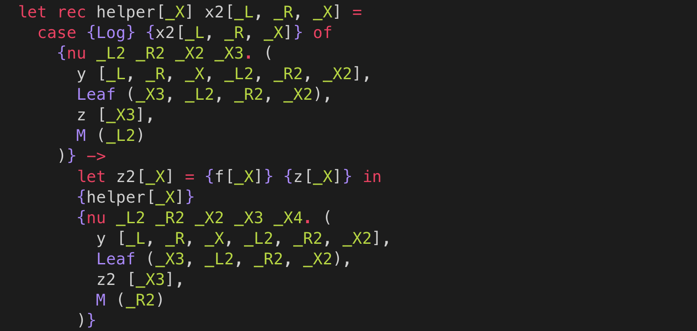

# lambda-gt.vim

A vim plugin for the Lambda GT language



## Installation

If your are using [vim-plug](https://github.com/junegunn/vim-plug), add the following below:

```vim
Plug 'sano-jin/lambda-gt.vim'
```

This package will recognize `*.lgt` files and apply the syntax highlighting.
